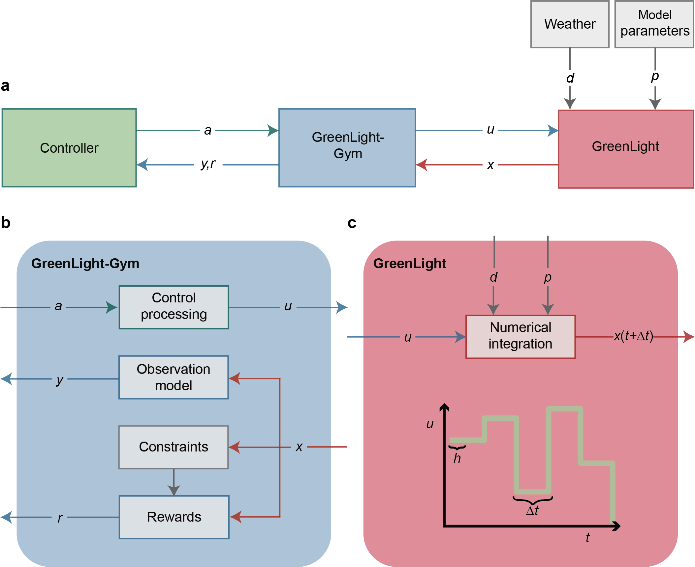

# GreenLight-Gym: A Reinforcement Learning Environment for Greenhouse Crop Production Systems 🍅

# UPDATE 09-05-2025

**We released a new version named [GreenLight-Gym2](https://github.com/BartvLaatum/GreenLight-Gym2). This new repository is accompanied with an accepted paper for The 8th IFAC Conference on Sensing, Control and Automation Technologies for Agriculture. Find the new preprint [here]((https://arxiv.org/abs/2410.05336)).**

## Summary

**This repository is a reimplementation of the high-tech greenhouse model [GreenLight](https://github.com/davkat1/GreenLight) in high-performance [Cython](https://cython.readthedocs.io/en/stable/index.html) code, wrapped by the Gymnasium environment. The environment is desinged to train reinforcement learning models for greenhouse crop production systems.**

<!-- Thes code in this repo was used for the following [preprint](https://arxiv.org/abs/2410.05336) that has been subimitted to the Computers and Electronics in Agriculture journal. -->


✏ author:  Bart van Laatum

📧 e-mail: bart.vanlaatum@wur.nl
___




The software has a modular architecture allowing users to study different aspects of the greenhouse control problem. For instance, one can customize:

- **Controllers** 
- **Controllable inputs**
- **Weather trajectories**
- **GreenLight model parameters**
- **Observations spaces**
- **Constraints & rewards**

## Installation
To be able to compile Cython code, and convert it into a C script, Windows user are required to Miscrosoft Visual Studio with Desktop C++ development. Also see this blog post over [here](https://stackoverflow.com/questions/60322655/how-to-use-cython-on-windows-10-with-python-3-8).

We recommend Python 3.11+ installation using [Anaconda](https://www.anaconda.com/).

1. Create a virtual conda environment as follows: 

```shell
conda create -n greenlight_gym python==3.11
```

and activate the environment:

```shell
conda activate greenlight_gym
```

2. Next, clone this repository

```shell
git clone git@github.com:BartvLaatum/GreenLightGym.git
```

and navigate into this folder

```shell
cd GreenLightGym
```

3. Subsequently, install this project as an development package as follows:

```shell
pip install -e .
```

This allows you to make modifications to the greenlight_gym codebase without having to reinstall the complete package.

4. Since this the GreenLight model is built using Cython, one must recompile the Cython code. This can be achieved by:

```shell
python setup.py build_cython_only --inplace
```

Which lets you rebuilt the GreenLight model without reinstalling the complete package again. Everytime you make adjustments to the Cython code one must recompile the code using the command.

## Usage

The script `experiments/train_agent.py` creates the RL-agent, and training and evaluation environments.
Simultaneously the agents is being trained, while logging statistics to Weights and Biases [(wandb)](https://wandb.ai/). Make sure to have a wandb account.

In the `configs/` folder you can define hyperparamters for your RL agents. Currently, only PPO is supported. Also, environment arguments can be specified.

## Run commands for training RL algorithms

There are several bash scripts that facilitate training RL agents in a similar fashion to our article. Please note that the default hyperparameters make your training time quite long. You could try to start with training a single agent for a lower amount of timesteps.

1) Running the convergence analysis experiment for both the multiplicate and the additive reward function:

```shell
. scripts/convergence_test.sh
```

2) Running the simulation study on the RL agents their sensitivity to penalty coefficients:

```shell
. scripts/penalty_coeffs.sh
```

3) Running the benchmark simulation study for two RL agents using a multiplicate and an additive reward function:

```shell
. scripts/benchmark.sh
```

4) Run the rule-based controller on the benchmark simulation using the following run command from the command line:

```shell
python -m greenlight_gym.experiments.benchmark_rule_based ----env_id <GLEnv> --n_years <numberofyeartoeval> --train_or_test <trainortestset> --config_name <nameoftheenvconfig-file> --save 
```

## Post processing data from Weights and Biases

If you have run the `convergence.sh` script then you can extract some training statistics via the wandb API by running:

```
python -m greenlight_gym.post_processing.extract_wandb_data.py --entity <wanbdusername> --project <wandbprojectname> --group <wanbdgroupname> 
```

## Notebooks for visualisations

You can visualise some of the results with the notebooks from the `visualisations/` folder.

1) `rollout_reward.ipynb` shows some statisitics on the training curves of the `convergence.sh` study.

2) `controller_analysis.ipynb` gives you a detailed analysis of controller performance and behaviour. Make sure to load in the right controller evaluation data, requires to have run `benchmark.sh` and the benchmark the rule-based controller.

3) `penalty_coeffs.ipynb` visualises the senstivity analysis of the penalty coefficients.

## Future updates

- Add environments based on setpoints instead of climate actuators.

- Implement model-based control methods like Model Predictive Control (MPC).

- Add different (off-policy) RL-models like SAC, DDPG, etc.

- Include recurrent policies. 
___

## Citation

If you find GreenLight-Gym and/or its accompanying article useful, please cite [GreenLight-Gym2](https://github.com/BartvLaatum/GreenLight-Gym2).
